# Planeacion del sistema en Jira
___

## Desglose de trabajo: Epicas, Historias de usuario y Tarea
___

La implementacion de los requerimientos identificados de Bankify se desglosa de la siguiente manera:

1. Epica: 

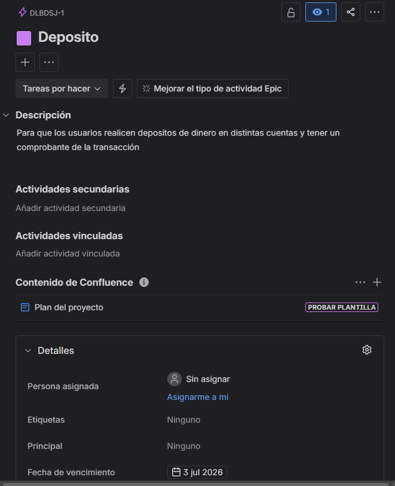

2. Historias de usuario:

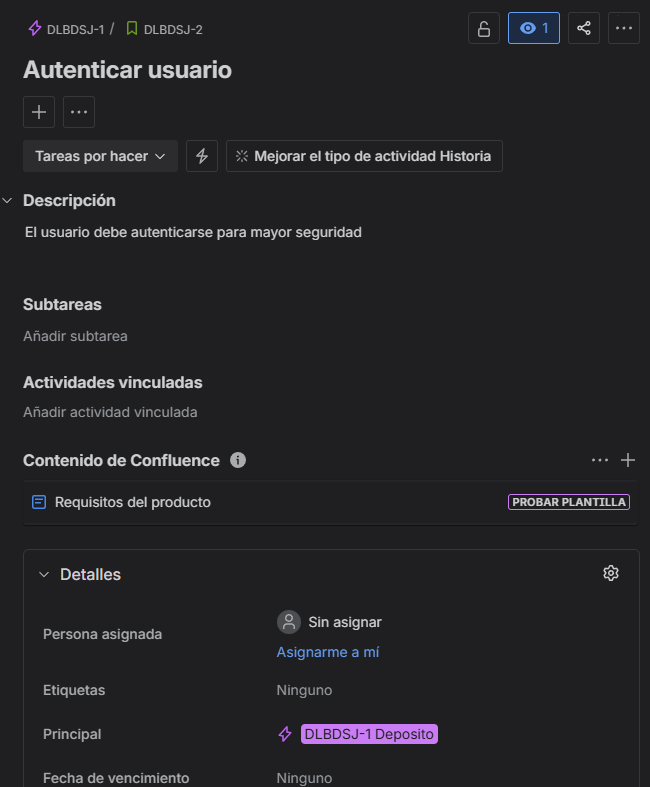
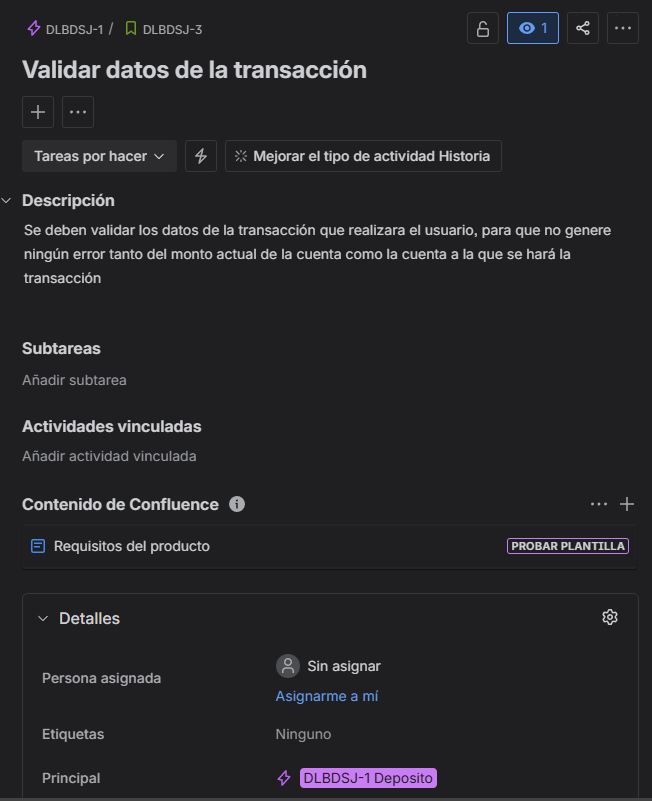
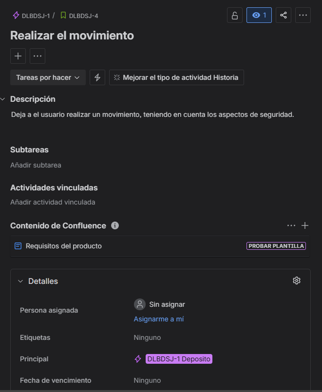
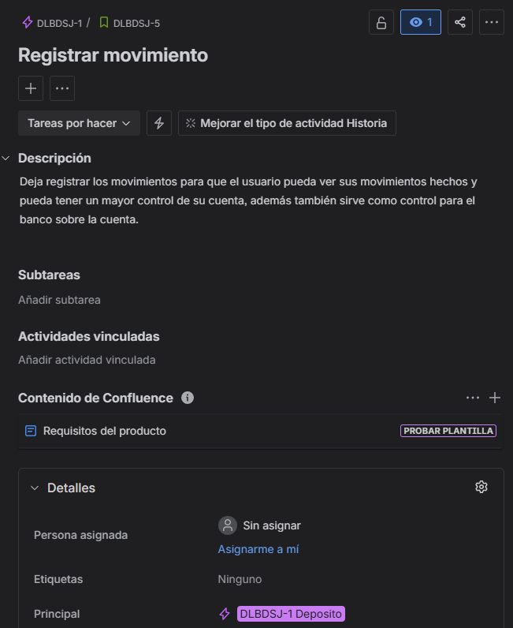

3. Tareas:

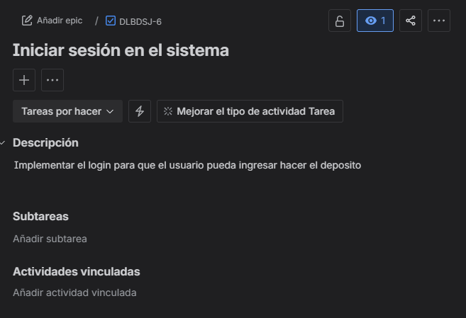
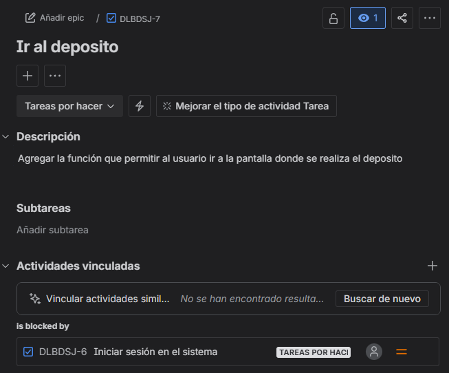
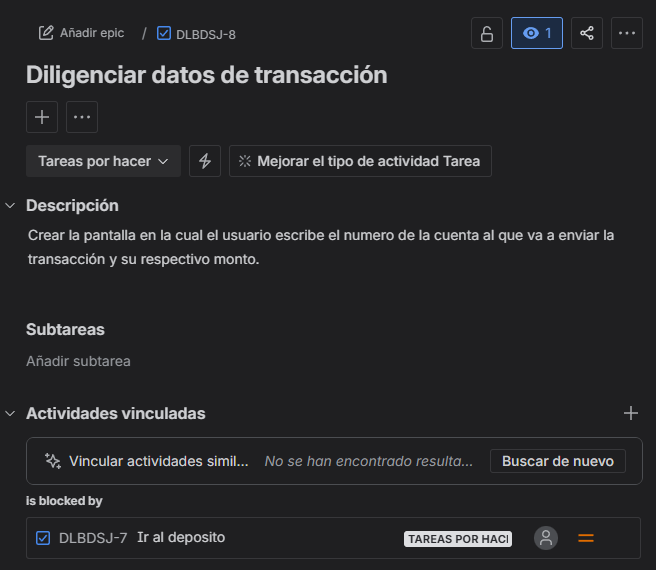
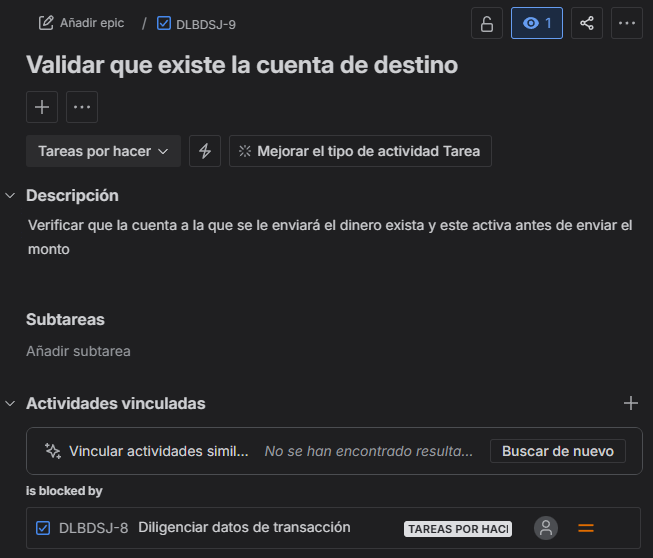
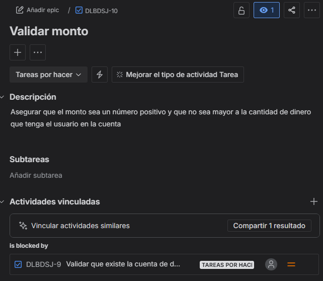
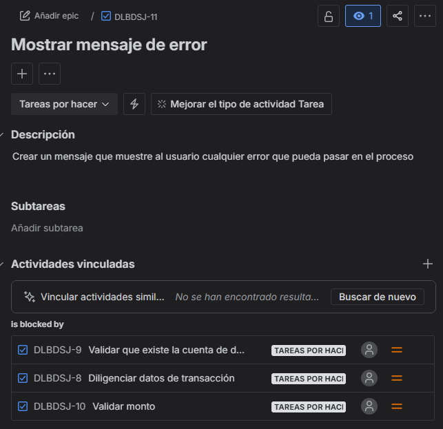
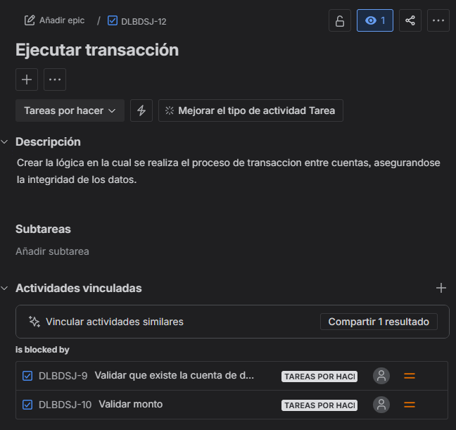
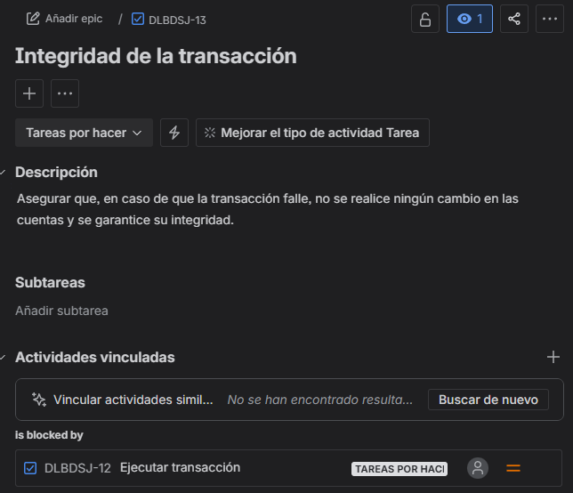
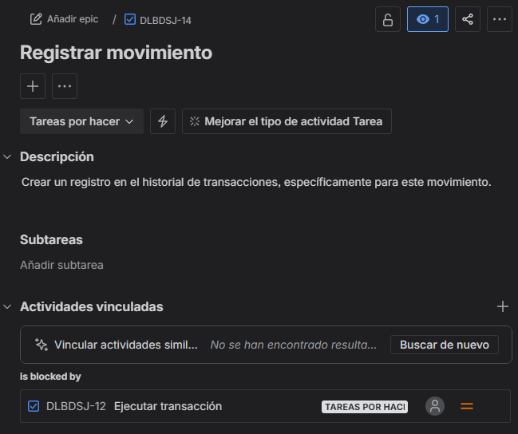
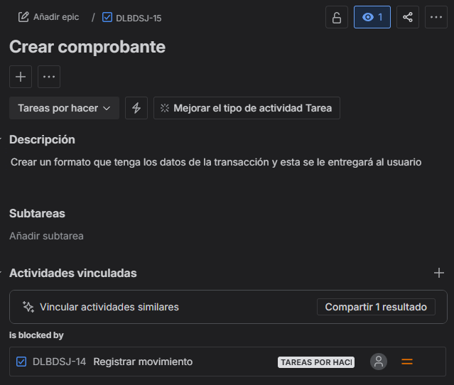
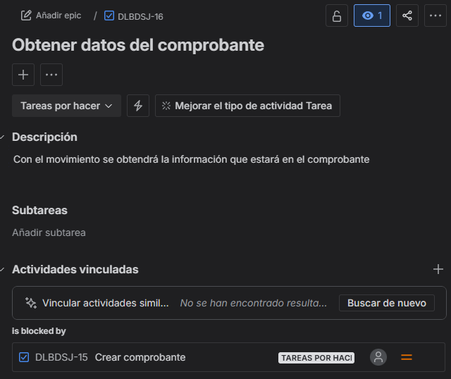
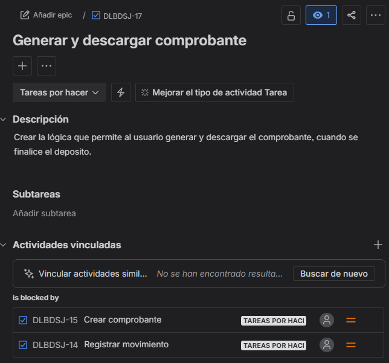

4. Cronograma:

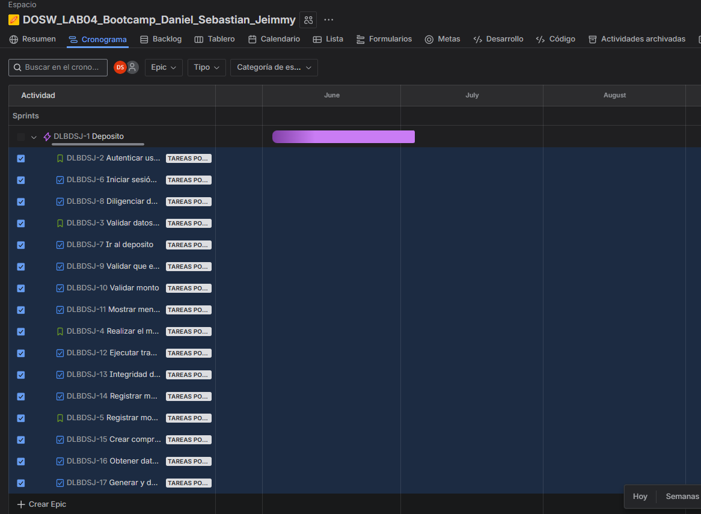

5. Backlog:

